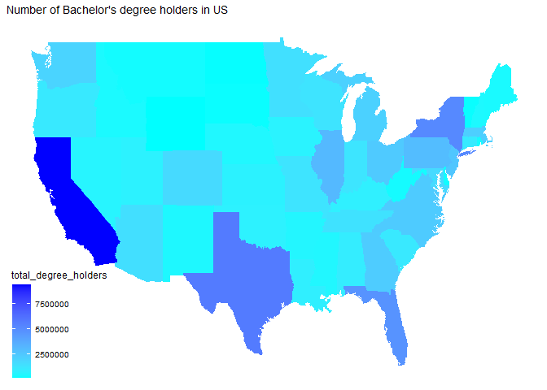
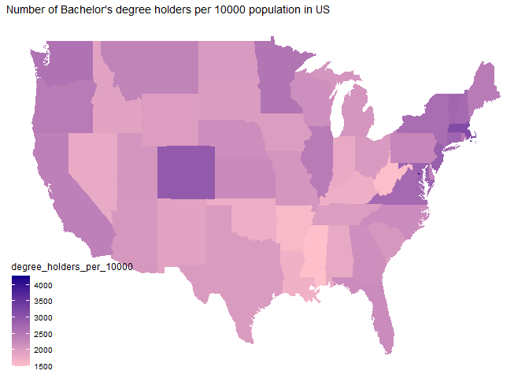
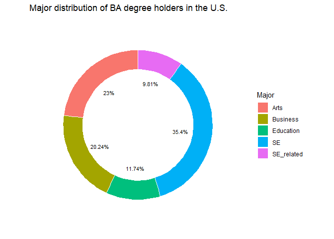
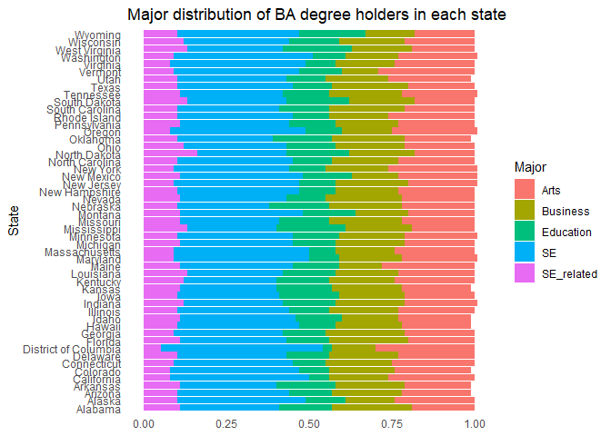
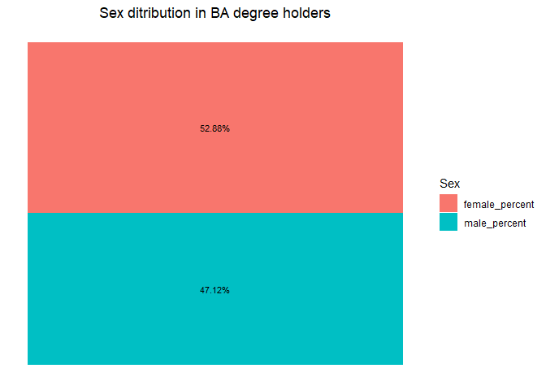
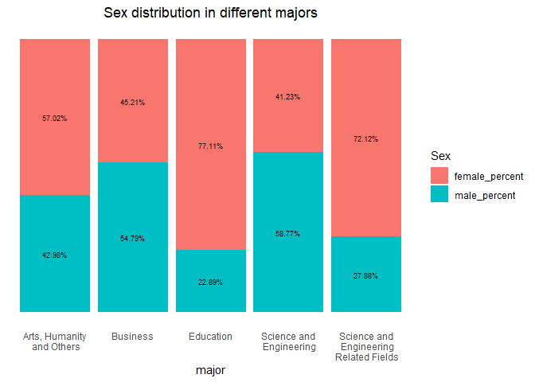
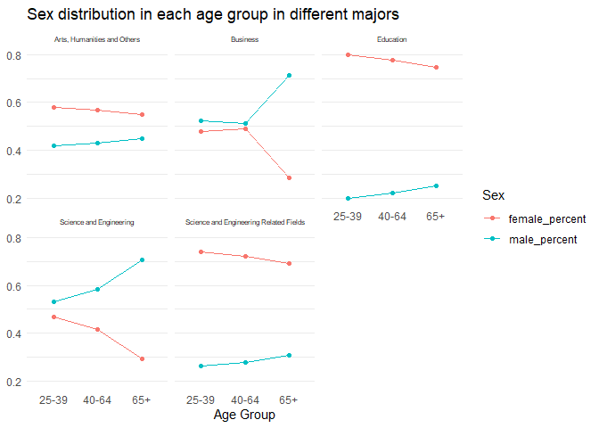
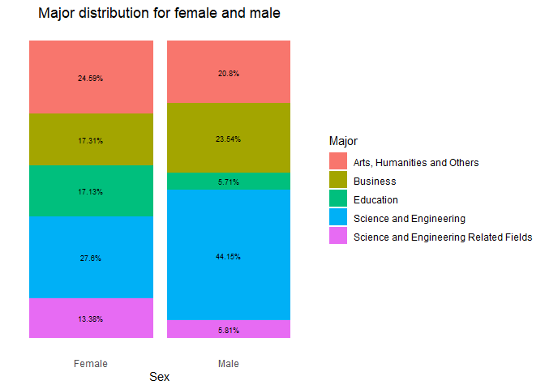
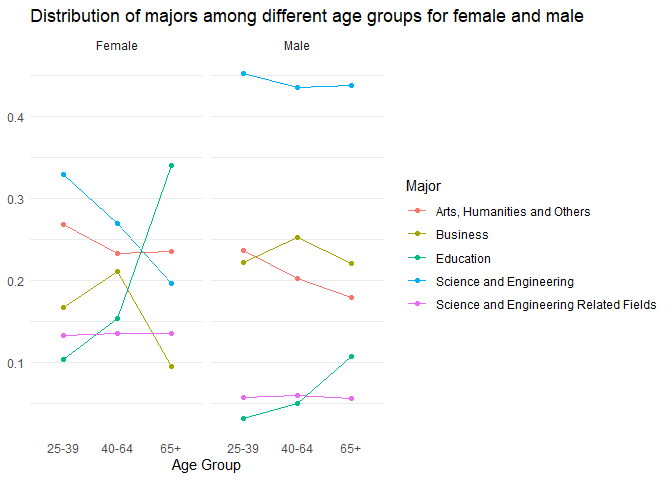

## Introduction and background

>Attaining a bachelor's degree has always triggered a question: Is it worth it? It often takes 3-5 years and high tuition to attain a college degree. For many students; however, college education is the indispensable path leading to success in the workforce. Unemployment rate among Americans who hold a college degree tends to be lower than those who do not. Moreover, jobs that require a higher education background are usually more lucrative. Seeking a better job and a higher income, students see college education as a fascinating give-and-take investment. In this blog, we are going to explore sex, state, major and age distribution in bachelor's degree holders. The question we are trying to answer is the trend of bachelor's degree holders choosing their major based on different age groups and sex.

## Data collection

>We obtain our data from Kaggle. The data contains information on the number of students that majored in different topics of study at universities in the United States in 2019 and is broken down by age group, sex, and state. There are 9 variables in total. We mainly focus on the age group over 25 years old and use the given information to create multiple visualizations, including map, column graphs, linear graphs, etc. We then do a separate analysis regarding different maps and graphs to seek the answer for factors that affect students choosing to pursue college education.

## In General
<!-- -->

> Let's first look at the geographic distribution of bachelor's degree holders throughout the nation. The graph above displays the total number of bachelor's degree holders throughout the United States. The deeper the color of the state, the larger the number of bachelor's degree holders is in that state. In general, we can see California, Texas, Florida, and New York have the most bachelor's degree holders. On the other hand, the large number of bachelor's degree holders could be due to the large population base or multiple universities in those states.  

<!-- -->

> Following what being said above, we now take into account the factor of population. In order to do that, we edit the unit from total degree holders to total degree holders per 10000 people. As we rule out the factor of population that might interfere with the resulting colored map, it's clear that states with deeper colors have totally changed. Bachelor degree holders density(total degree holders per 10000 people) is higher in Colorado, Washington, Virginia, New Jersey and Massachusetts. 

## Major distribution

>Now, let us take a deeper look at the Bachelor's degree holders by looking at the major distribution.

<!-- -->

> This graph divides all majors into five categories and displays the proportion of each category. We can see that 35.4% of the majors are under the SE (Science and Engineering) category. In addition, SE related majors also occupy 9.81% of all majors, which made SE and its related majors account for 45.21% of all majors throughout the United States in 2019. On the other hand, majors under the education category only hold 11.74% of all majors in 2019, which is only about one fourth of the SE and its related category. Majors under Business and Arts caetegory hold 20.24% and 23% of all majors respesctively. Next, we will look at the proportion of each category `in each state`.

<!-- -->

> In general, we can see that the distribution of majors in each state is similar to the overall distribution throughout the U.S. as we saw in the previous graph. However, the Education category hold equal or even more proportion than the Business category in some states such as Wyoming, West Virginia, and South Dakota. One interesting thing to note is that District of Columbia had the largest proportion for both Arts and SE & its related categories, while the Education category hold the smallest proportion throughout the nation. 

## Including Sex and Age Group 

>We have not including sex and age group yet, which are two important variables that help us explore more about the data set. For example, what does the general sex distribution look like? What about the sex distribution in different major and age group? What will the major distribution look like in different sex and age group? The following graphs will provide answers to the questions that we mentioned above.

<!-- -->

> We are curious about sex distribution in bachelor's degree holders. To begin with, we create a simple visualization of showing the proportion of each sex group over 25 years old in bachelor's degree holders. The visualization clearly tells that the female group constitutes a larger portion of bachelor's degree holders, 5.76% higher than the male group. 

>What about the sex distribution in each of the five categories we discussed earlier?

<!-- -->

> From the graph, we can definitely tell that the female group often dominates in art,humanities and others, education, and science and engineering related fields, but male group represents a higher proportion in business and science and engineering fields. This result is not surprising, as we often see more females working in humanities organizations and in school, and more males working as businessmen and engineers. The visualization represents the trend of different sex group choosing their major fields. 

<!-- -->

> Now we take one more step to look at the sex distribution of `each age group` in each category. We can see that for all five categories, the proportion of female bachelor's degree holders decreases for older age groups. On the other hand, the proportion of male bachelor degree holders increases for older age  groups. This pattern isn't too surprising because back in the old days, people tended to think of women as staying at home and taking care of the children; therefore, women were less likely to achieve a bachelor's degree. Fortunately, the proportion of demale bachelor's degree is higher in the younger age groups for all five categories, which suggests that the feminist movement is getting some positive results.

<!-- -->

> What if we take a different approach to look at the distribution of majors for both male and female? From this graph, we can see that the distribution of majors is much more even for female than male. For female, Arts and SE categories account for the largest proportion and both hold approximately 25% of all majors. For male, we can see that almost half of the majors in bachelor's degree were in the SE category, and only about 5% of the majors were in the Education category.

<!-- -->

> Next, we take one more step to look at the distribution of majors among different age groups for both male and female. We notice that although the proportion of each category is different for both sex, the trend among different age groups is very similar for both sex. For Arts & Humanity category, we can see that the proportion is higher in younger age groups than in older age groups regardless of sex, which means Arts & Humanity majors got more popular in the past century. For Business majors, we see that the `40 to 64` age group has the highest proportion for both sex, which suggests that Business majors were more popular between 1975 and 1999 than before or after that time period. For Education majors, we see higher proportions in older age groups than younger age groups for both sex, which suggests education majors got less popular in the past century. For Science and Engineering (SE) majors, we see higher proportions in younger age groups than in older age groups for both sex, but the increase in female was much more steep compared to the increase in male. Lastly, the proportion of SE and related majors was quite steady among all age groups for both sex, as we can see the line is pretty flat.

## Conclusion

>In this project, we found bachelor’s degree holders have different choices of major based on their sex and age group. According to the pure sex analysis, females tend to pursue bachelor degree more than males. A reasonable explanation for this result is that females are more eager to improve their social status and believe college education provides more resources and opportunities. Moreover, the gap between males and females’ choices of major tends to be shortened as their age group becomes younger. This suggests a balance of sex in career choices and an improvement of gender equality in the workforce.
